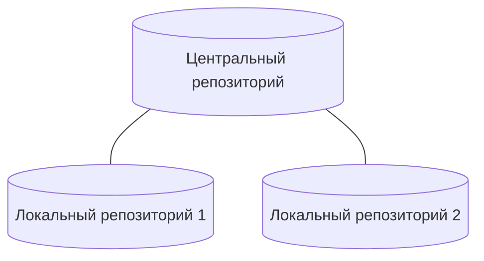

# Глава 19. Управление версиями

> Яотказываюсь делать то, что могут сделать компьютеры.

<p style="text-align: right;"><i>Олин Шиверс</i></p>

### Репозитории
Р - это структура данных, созданная системой управления версиями, которая отслеживает все изменения в проекте.

Структура данных - это способ организовать и хранить информацию. Р на вид каталог с фалами.



### Команды GIT

Скопировать удаленный репозиторий на копьютер:
```bash
$git clone ссылка_на_репозиторий

>> ussage: git [--version][--help][-C <path>][-c name=value]
   ...
```
Вывести URL-адрес центрального репозитория (удаленного):
```bash
$git remote -v
```
флаг -v для вывода дополнительной информации

Процесс помещения данных из локального репозитория в удаленный состояит из 3х шагов:
1. Поместить в индекс - *git add имя_файла* или *git add .* Чтобы отменить индексацию - *git reset имя_файла*
2. Сохранить состояние - *git commit -m ваш_комментарий*. Комментарий поможет запомнить вносимые изменения и их причины.
3. Внести изменения в удаленный репозиторий - *git push origin main* 
Посмотреть статус файлов:
```bash
$git status
```
Получить изменения из удаленного репозитория:
```bash
$git pull origin main
```

#### Откат версий
У каждого состояния есть уникальный номер. Чтобы посмотреть историю состояний проекта
```bash
$git log
>> commit 8e03254f54g5 Author: ...
```
Чтобы откатить к определенной версии:
```bash
$git checkout 8e03254f54g5
```

#### Команда *git diff*
демонстрирует разницу между файлом в локальном и удаленном репозитории.
```bash
$git diff имя_файла
```


