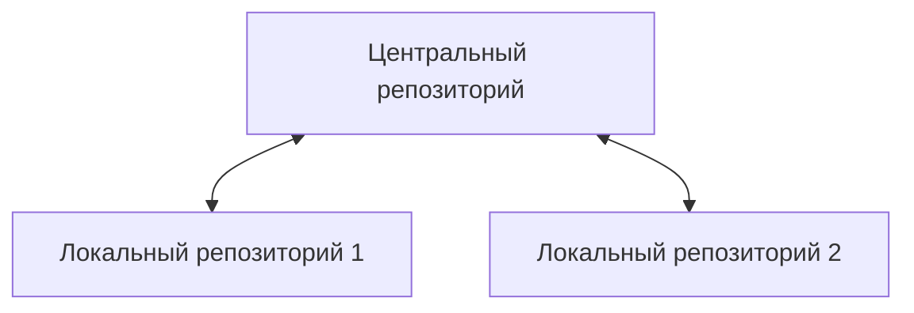

# Глава 19. Управление версиями

> Яотказываюсь делать то, что могут сделать компьютеры.

<p style="text-align: right;"><i>Олин Шиверс</i></p>

### Репозитории
Р - это структура данных, созданная системой управления версиями, которая отслеживает все изменения в проекте.

Структура данных - это способ организовать и хранить информацию. Р на вид каталог с фалами.



```bash
$git

>> ussage: git [--version][--help][-C <path>][-c name=value]
   ...
```


